#                                           Advanced Lane Finding Project


The goals / steps of this project are the following:

1. Create a software application that can calibrate the camera images for distortion so that the actual images are corrected for distortion.
2. Create a pipeline and test the pipeline to convert a camera image into a binary image that identifies the lanes after undistortion
3. Create additional code that identifies the lane position and apply the same on the original image to identify the lanes
4. Test the application on few test images 
5. Finally test the application on videos and create an output video with lanes identified


## [Rubric](https://review.udacity.com/#!/rubrics/571/view) Points

### Here I have considered the rubric points individually and described how I addressed each point in my implementation.  


#### 1. Provide a Writeup / README that includes all the rubric points and how you addressed each one.  You can submit your writeup as markdown or pdf.  [Here](https://github.com/udacity/CarND-Advanced-Lane-Lines/blob/master/writeup_template.md) is a template writeup for this project you can use as a guide and a starting point.  

This project has implemented the following steps

* Compute the camera calibration matrix and distortion coefficients given a set of chessboard images.
* Apply a distortion correction to raw images.
* Use color transforms, gradients, etc., to create a thresholded binary image.
* Apply a perspective transform to rectify binary image ("birds-eye view").
* Detect lane pixels and fit to find the lane boundary.
* Determine the curvature of the lane and vehicle position with respect to center.
* Warp the detected lane boundaries back onto the original image.
* Output visual display of the lane boundaries and numerical estimation of lane curvature and vehicle position

I tested the pipeline first on single image to check if the binary output was as expected. Then i tested the application on multiple images including those images where tree shades falls on the lane. Once this is done, i tested my application on full code and then later with the video

### Camera Calibration

#### 1. Briefly state how you computed the camera matrix and distortion coefficients. Provide an example of a distortion corrected calibration image.

I start by preparing "object points", which will be the (x, y, z) coordinates of the chessboard corners in the world. Here I am assuming the chessboard is fixed on the (x, y) plane at z=0, such that the object points are the same for each calibration image.  Thus, `objp` is just a replicated array of coordinates, and `objpoints` will be appended with a copy of it every time I successfully detect all chessboard corners in a test image.  `imgpoints` will be appended with the (x, y) pixel position of each of the corners in the image plane with each successful chessboard detection.  

I then used the output `objpoints` and `imgpoints` to compute the camera calibration and distortion coefficients using the `cv2.calibrateCamera()` function.  I applied this distortion correction to the test image using the `cv2.undistort()` function and obtained this result: 

```python
#---------------------------------------------------------------------------------------------------------------------------#

# this function calibrates the camera. Takes inputs as Path- Path where calibration images are present.
# Imgcornertype 69 or 68 depending upon no of corners
# function returns - ret,mtx,dist,rvecs,tvecs

def calibrate_camera(path,imgcornertype):
    
    if debug_flag == True:
        print("starting camera calibration")
        print("!!!!!!!!!!!!!!!!!!!!!!!!!!!!!!!!!!!!!!!!!!!!!!!!")
    
    #initialize arrays to store object and image points
    objpoints = [] #3d points in real world space
    imgpoints = [] #2d points in image space
    
    if output_flag == True:
        fig, axs = plt.subplots(5,4, figsize=(16, 11))
        fig.subplots_adjust(hspace = .2, wspace=.001)
        axs = axs.ravel()
    
    if imgcornertype == 69:
        objp = np.zeros((6*9,3), np.float32)
        objp[:,:2] = np.mgrid[0:9,0:6].T.reshape(-1,2)
    elif imgcornertype == 68:
        objp = np.zeros((6*8,3),np.float32)
        objp[:,:2] = np.mgrid[0:8,0:6].T.reshape(-1,2)
            
    if imgcornertype == 69:
        cory = 9
        corx = 6
    elif imgcornertype == 68:
        corx = 6
        cory = 8
    index = 0 
    
    for imagename in os.listdir(path):
        
        img = cv2.imread(path + imagename)
        if output_flag == True:
            print('calibrating camera for image', imagename)
            #plt.imshow(img)
            #plt.show()

        # Conver to grayscale
        gray = cv2.cvtColor(img,cv2.COLOR_BGR2GRAY)

        # find chessboard corners
        ret,corners = cv2.findChessboardCorners(gray,(cory,corx),None)
               

        #if corners are found, add object points, img points
        if ret == True:
            imgpoints.append(corners)
            objpoints.append(objp)
            img = cv2.drawChessboardCorners(img,(cory,corx),corners,ret)
            if output_flag == True:
                axs[index].axis('off')
                axs[index].imshow(img)
                index += 1
            if debug_flag == True:
                print("corner identified for image",imagename)
                print("corner shape is ", corners.shape)
                print("corner is ", corners)
                       
        else:
             if debug_flag == True:
                    print("corners not identified for image",imagename)


    #get calibration matrix
    ret,mtx,dist,rvecs,tvecs = cv2.calibrateCamera(objpoints,imgpoints,gray.shape[::-1],None,None)
    

    if debug_flag == True:
        print(gray.shape[::-1])
        print("ret is ",ret)
        print("mtx is", mtx)
        print("dist is", dist)
        print("rvecs is ", rvecs)
        print("tvecs is", tvecs)
        print("camera calibration done. ")
        print("!!!!!!!!!!!!!!!!!!!!!!!!!!!!!!!!!!!!!!!!!!!!!!!!")

    # delete unwanted objects        
    del objpoints
    del imgpoints
    
    return ret,mtx,dist,rvecs,tvecs

```
This is the main code where Camera calibration happens.

```python
# Callibrate  Camera
output_flag = True
path1 = "./camera_cal/"
ret,mtx,dist,rvecs,tvecs = calibrate_camera(path1,69)#################    test images with pipeline to identify lane  #########################

```
### Output of camera calibration

    calibrating camera for image calibration10.jpg
    calibrating camera for image calibration6.jpg
    calibrating camera for image calibration9.jpg
    calibrating camera for image calibration7.jpg
    calibrating camera for image calibration19.jpg
    calibrating camera for image calibration20.jpg
    calibrating camera for image calibration16.jpg
    calibrating camera for image calibration1.jpg
    calibrating camera for image calibration17.jpg
    calibrating camera for image calibration2.jpg
    calibrating camera for image calibration8.jpg
    calibrating camera for image calibration4.jpg
    calibrating camera for image calibration15.jpg
    calibrating camera for image calibration3.jpg
    calibrating camera for image calibration14.jpg
    calibrating camera for image calibration11.jpg
    calibrating camera for image calibration13.jpg
    calibrating camera for image calibration12.jpg
    calibrating camera for image calibration5.jpg
    calibrating camera for image calibration18.jpg


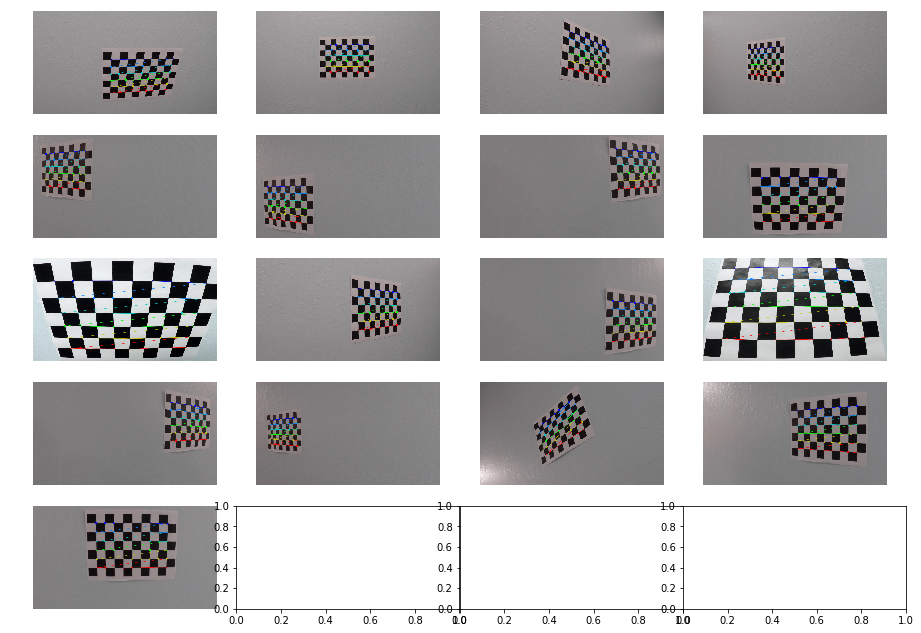


### Pipeline (single images)

Here is the code for the pipeline

```python
def pipeline_image_processing(test_img,imagename):
    
    # undistor image
  
    test_img_undistort = undistort_img(test_img,mtx,dist)
    height,width = test_img_undistort.shape[:2]
    
    # define source and destination points for transform
    src = np.float32([(575,464),
                  (707,464), 
                  (258,682), 
                  (1049,682)])
    dst = np.float32([(450,0),
                  (width-450,0),
                  (450,height),
                  (width-450,height)])
     
    # map the src and dst points
    if debug_flag == True:
        print('undistored image')
        print("height is", height)
        print("width is", width)
        print("src is ", src)
        print("dest is ", dst)
    # perspective transformation
    vertices = np.array([[300, 0], [300,700], [1000,700], [1000,0]])
   
    test_img_unwarp, M, Minv = unwarp_image(test_img_undistort,src,dst)

    if output_flag == True:
        fig,(axs1,axs2) = plt.subplots(1,2, figsize=(20, 10))
        fig.subplots_adjust(hspace = .2, wspace=.001)
        
        axs1.imshow(test_img)
        axs1.annotate('A',xy=(575,464),fontsize=20)
        axs1.annotate('B',xy=(707,464),fontsize=20)
        axs1.annotate('C',xy=(258,682),fontsize=20)
        axs1.annotate('D',xy=(1049,682),fontsize=20)
           
        axs2.imshow(test_img_unwarp)
        axs2.annotate('A',xy=(450,0),fontsize=20)
        axs2.annotate('B',xy=(width-450,0),fontsize=20)
        axs2.annotate('C',xy=(450,height),fontsize=20)
        axs2.annotate('D',xy=(width-450,height),fontsize=20)
        
    # Sobel Magnitude (using default parameters)
    img_sobel_Mag = set_ROI(mag_thresh(test_img_unwarp),vertices)
    
    # Sobel Direction (using default parameters)
    img_sobel_dir = set_ROI(dir_threshold(test_img_unwarp),vertices)
    
    if debug_flag == True:
        print('shape of img_sobel_Mg', img_sobel_Mag.shape)
        print('shape of img_sobel_dir', img_sobel_dir.shape)
        
    # HLS H-channel Threshold
    img_hls_h = set_ROI(hls_h_select(test_img_unwarp),vertices)
    
    # HLS S-channel Threshold
    img_hls_s = set_ROI(hls_s_select(test_img_unwarp),vertices)
    
    # HLS L-channel Threshold
    img_hls_l = set_ROI(hls_l_select(test_img_unwarp),vertices)
    
    #Sobel X and Y
    img_gradx = set_ROI(abs_sobel_thresh(test_img_unwarp, orient ='x', sobel_kernel = 3, thresh=(30,255)),vertices)
    
    img_grady = set_ROI(abs_sobel_thresh(test_img_unwarp, orient ='y', sobel_kernel = 3, thresh=(30,255)),vertices)
    
    combined = np.zeros_like(img_sobel_Mag)
    
    if output_flag == True:
    
        draw_simple_chart(test_img,test_img_undistort,'Original image','undistored image')
        draw_simple_chart(test_img,test_img_unwarp,'Original image','Perspective Transformed image')
        draw_simple_chart(test_img,img_sobel_dir,'Original image','Sobel Direction')
        draw_simple_chart(test_img,img_sobel_Mag,'Original image','Sobel Magnitude')
        draw_simple_chart(test_img,img_gradx,'Original image','Gradx')
        draw_simple_chart(test_img,img_grady,'Original image','Grady')
        draw_chart_channels(img_hls_h,img_hls_l,img_hls_s,"h channel","l channel","s channel")

    combined[ ((img_gradx == 1) | (img_sobel_dir ==1) | ((img_hls_s ==1) & (img_hls_l ==1)))] =1
    
    if debug_flag == True:
        print('combined initial shape', combined.shape)
        print('shape of img_gradx', img_gradx.shape)
        print('shape of img_grady', img_grady.shape)
        print('combined final shape', combined.shape)
        print('exiting pipeline processing')

    if final_flag == True:
        draw_simple_chart(test_img,combined,"original","binary")
    return combined, Minv     


```

#### 1. Provide an example of a distortion-corrected image.

Here is the code for distortion correction:

```python

# function undistors the image
def undistort_img(img,mtx,dist):
    img = cv2.undistort(img,mtx,dist,None,mtx)
    return img
```
To demonstrate this step, I will describe how I apply the distortion correction to one of the test images like this one:


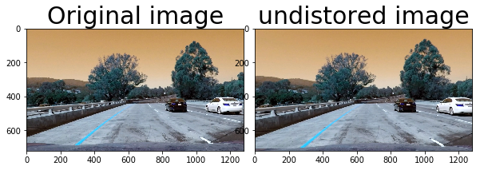


#### 2. Describe how (and identify where in your code) you used color transforms, gradients or other methods to create a thresholded binary image.  Provide an example of a binary image result.

I used a combination of color and gradient thresholds to generate a binary image. Below are the details

1. HLS Channels
2. Sobel Magnitude
3. Sobel Direction
4. Sobel X and Y

I tested various images for each of these techniques with various thresholds and decided to go with only few methods to get the desired output. However, almost all of these methods were not working for atleast one or two scenarios and most of them like HLS Channels had unwanted pixels along with lanes. So the final binary image had multiple peaks in histogram. so to avoid this, I created a ROI and applied that to the output of these channels to remove these noises.

```python
# set ROI for an image img based on the input vertices
def set_ROI(img,vertices):
    mask = np.zeros_like(img)
    if len(img.shape) > 2:
        channel_count = img.shape[2]  
        ignore_mask_color = (255,) * channel_count
    else:
        ignore_mask_color = 255
    cv2.fillPoly(mask, np.int32([vertices]), ignore_mask_color)
    masked_image = cv2.bitwise_and(img, mask)
    return masked_image
```

Here's an example of my output for this step.  (note: this is not actually from one of the test images)


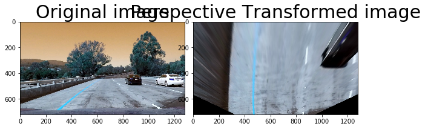


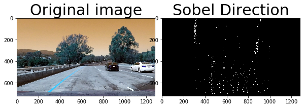


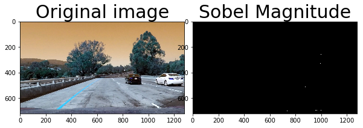


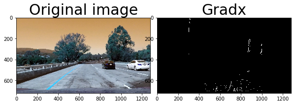


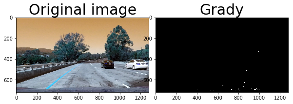


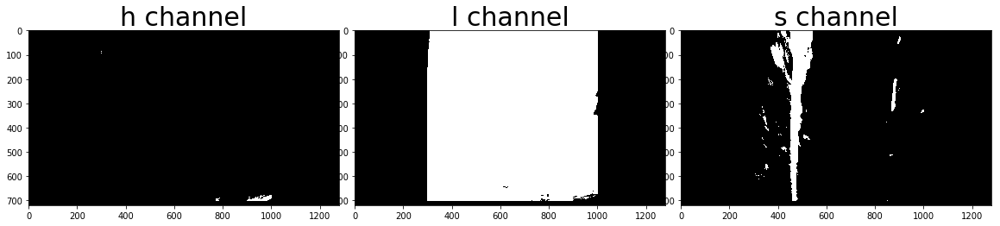


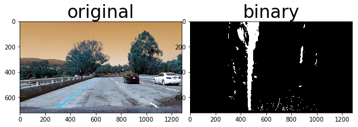


#### 3. Describe how (and identify where in your code) you performed a perspective transform and provide an example of a transformed image.

I selected the points by ensuring that the points exactly covered the lane.

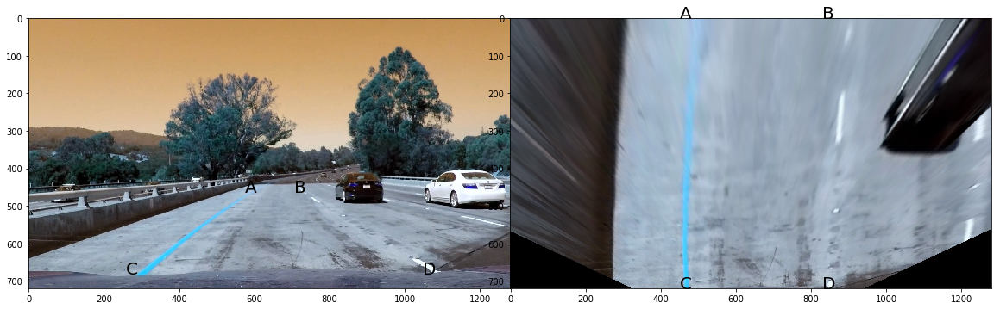

I verified that my perspective transform was working as expected by drawing the `src` and `dst` points onto a test image and its warped counterpart to verify that the lines appear parallel in the warped image.  Here is the code for the perspective transformation. The code returns the warped image, M and Minv (for later applying reverse transformation)

```python
 src = np.float32([(575,464),
                  (707,464), 
                  (258,682), 
                  (1049,682)])
    dst = np.float32([(450,0),
                  (width-450,0),
                  (450,height),
                  (width-450,height)])
                  
# function does a perspective transformation
def unwarp_image(img, src, dst):
    height,width = img.shape[:2]
    M = cv2.getPerspectiveTransform(src, dst)
    Minv = cv2.getPerspectiveTransform(dst, src)
    warped = cv2.warpPerspective(img, M, (width,height), flags=cv2.INTER_LINEAR)
    return warped, M, Minv
    
```


#### 4. Describe how (and identify where in your code) you identified lane-line pixels and fit their positions with a polynomial?

Below is the code here lanes are identified and poly fitting is done. 

```python

#function to process multiple images using the Pipeline and does the below functions in addition to the pipeline:
#   1. Lane fitting
#   2. creating an image with polyfill to cast the lanes
#   3. recasting the polyfill image on the original image
#   4. Draw teh lane based on the above
#   5. caculate the radius and curature


def Fully_process_images(img,imagename):
   
    if debug_flag == True:
        print('starting process multiple iamges')
        print('starting pipeline process for ', imagename)
        print("l-allx",l_line.allx)
        print("r-allx", r_line.allx)
        print("l_line.ally",l_line.ally)
        print("r_line.ally", r_line.ally)
        print("r_line.bestx", r_line.bestx)
        print("l_line.bestx",l_line.bestx)
        print("r_line.best_fit",r_line.best_fit)
        print("l_line.best_fit",l_line.best_fit)
        print("r_line.current_fit",r_line.current_fit)
        print("l_line.current_fit",l_line.current_fit)
        
    new_img = np.copy(img)
    img_bin, Minv = pipeline_image_processing(new_img,imagename)
    if debug_flag == True:
        print('completed pipeline process for ',imagename)
    
    # if both left and right lines were detected last frame, use polyfit_using_prev_fit, otherwise use sliding window
    if not l_line.detected or not r_line.detected:
        if debug_flag == True:
            print('starting sliding window polyfit for first iamge')
        l_fit, r_fit, l_lane_inds, r_lane_inds, histogram = sliding_window_polyfit(img_bin)
        if debug_flag == True:
            print("left fit from sliding window output is ", l_fit)
            print("right fit from sliding window output is ", r_fit)
            print("left lane indic from sliding window output is ", l_lane_inds)
            print("right lane indic from sliding window output is ", r_lane_inds)
            
        if output_flag == True:
            print('histogram for image',imagename)
            plt.plot(histogram)
            plt.xlim(0, 1280)
            plt.show()
            print('...')
    else:
        l_fit, r_fit, l_lane_inds, r_lane_inds =  polyfit_next_fit(img_bin, l_line.best_fit, r_line.best_fit)
        if debug_flag == True:
            print('starting sliding window polyfit for subsequent images')
            print(l_line.best_fit)
            print("left fit is ", l_fit)
            print("right fit is ", r_fit)
        
    # invalidate both fits if the difference in their x-intercepts isn't around 350 px (+/- 100 px)
    if l_fit is not None and r_fit is not None:
        if debug_flag == True:
            print('Fit not found for ',imagename)
        # calculate x-intercept (bottom of image, x=image_height) for fits
        h = img.shape[0]
        l_fit_x_int = l_fit[0]*h**2 + l_fit[1]*h + l_fit[2]
        r_fit_x_int = r_fit[0]*h**2 + r_fit[1]*h + r_fit[2]
        x_int_diff = abs(r_fit_x_int-l_fit_x_int)
        if abs(350 - x_int_diff) > 100:
            l_fit = None
            r_fit = None
    else:
        if debug_flag == True:
            print('image invalidated failed',img)
    
    if debug_flag == True:
            print('adding right and left fit to class',imagename) 
            print('fit class values before adding')
            print("l-allx",l_line.allx)
            print("r-allx", r_line.allx)
            print("l_line.ally",l_line.ally)
            print("r_line.ally", r_line.ally)
            print("r_line.bestx", r_line.bestx)
            print("l_line.bestx",l_line.bestx)
            print("r_line.best_fit",r_line.best_fit)
            print("l_line.best_fit",l_line.best_fit)
            print("r_line.current_fit",r_line.current_fit)
            print("l_line.current_fit",l_line.current_fit)
            print("adding l_fit",l_fit)
            print("adding r_fit",r_fit)
            
            
    l_line.add_fit(l_fit, l_lane_inds)
    r_line.add_fit(r_fit, r_lane_inds)
    if debug_flag == True:
            print('added right and left fit to class',imagename) 
            print('fit class values after adding')
            print("r-allx", r_line.allx)
            print("l_line.ally",l_line.ally)
            print("r_line.ally", r_line.ally)
            print("r_line.bestx", r_line.bestx)
            print("l_line.bestx",l_line.bestx)
            print("r_line.best_fit",r_line.best_fit)
            print("l_line.best_fit",l_line.best_fit)
            print("r_line.current_fit",r_line.current_fit)
            print("l_line.current_fit",l_line.current_fit)
            
    # draw the current best fit if it exists
    if l_line.current_fit is not None and r_line.current_fit is not None:
        if debug_flag == True:
            print('best fit found',img)
        img_out1 = draw_lane(new_img, img_bin, l_line.best_fit, r_line.best_fit, Minv)
        rad_l, rad_r, d_center = calculate_rad(img_bin, l_line.best_fit, r_line.best_fit, 
                                                               l_lane_inds, r_lane_inds)
        img_out = draw_curvature(img_out1, (rad_l+rad_r)/2, d_center)
        
    else:
        print('best fit not found',imagename)
        img_out = new_img
        
    if final_flag == True:
        draw_simple_chart(img,img_out,"original","final")
    return img_out
    
    def sliding_window_polyfit(img):
    
    if debug_flag == True:
        print('starting sliding window polyfit')
       
    histogram = np.sum(img[img.shape[0]//2:,:], axis=0)
    
    # Create an output image to draw on and  visualize the result
    out_img = np.dstack((img, img, img))*255
    
    # Find the peak of the left and right halves of the histogram
    # These will be the starting point for the left and right lines
    midpoint = np.int(histogram.shape[0]//2)
    leftx_base = np.argmax(histogram[:midpoint])
    rightx_base = np.argmax(histogram[midpoint:]) + midpoint
    if debug_flag == True:
        print("midpoint of histogram is", midpoint)
        print("leftx_base of histogram is", leftx_base)
        print("rightx_base of histogram is", rightx_base)
        
    # Choose the number of sliding windows
    nwindows = 10
    
    # Set height of windows
    window_height = np.int(img.shape[0]/nwindows)
    
    # Identify the x and y positions of all nonzero pixels in the image
    nonzero = img.nonzero()
    nonzeroy = np.array(nonzero[0])
    nonzerox = np.array(nonzero[1])
    
      
    # Current positions to be updated for each window
    leftx_current = leftx_base
    rightx_current = rightx_base
    
    if debug_flag == True:
        print("nonzeroy is ", nonzeroy)
        print("nonzerox is ", nonzerox)
        print("current position lefx", leftx_current )
        print("current position rightx", rightx_current )
        
    # Set the width of the windows +/- margin
    margin = 80
    
    # Set minimum number of pixels found to recenter window
    minpix = 50
    
    # Create empty lists to receive left and right lane pixel indices
    left_lane_inds = []
    right_lane_inds = []

    # Step through the windows one by one
    for window in range(nwindows):
        # Identify window boundaries in x and y (and right and left)
        win_y_low = img.shape[0] - (window+1)*window_height
        win_y_high = img.shape[0] - window*window_height
        win_xleft_low = leftx_current - margin
        win_xleft_high = leftx_current + margin
        win_xright_low = rightx_current - margin
        win_xright_high = rightx_current + margin
        # Draw the windows on the visualization image
        cv2.rectangle(out_img,(win_xleft_low,win_y_low),(win_xleft_high,win_y_high),
        (0,255,0), 2) 
        cv2.rectangle(out_img,(win_xright_low,win_y_low),(win_xright_high,win_y_high),
        (0,255,0), 2) 
        # Identify the nonzero pixels in x and y within the window
        good_left_inds = ((nonzeroy >= win_y_low) & (nonzeroy < win_y_high) & 
        (nonzerox >= win_xleft_low) &  (nonzerox < win_xleft_high)).nonzero()[0]
        good_right_inds = ((nonzeroy >= win_y_low) & (nonzeroy < win_y_high) & 
        (nonzerox >= win_xright_low) &  (nonzerox < win_xright_high)).nonzero()[0]
        # Append these indices to the lists
        left_lane_inds.append(good_left_inds)
        right_lane_inds.append(good_right_inds)
        # If you found > minpix pixels, recenter next window on their mean position
        if len(good_left_inds) > minpix:
            leftx_current = np.int(np.mean(nonzerox[good_left_inds]))
        if len(good_right_inds) > minpix:        
            rightx_current = np.int(np.mean(nonzerox[good_right_inds]))
        if debug_flag == True:
            print("window is ", window)
            print("win_y_low", win_y_low)
            print("win_y_high", win_y_high)
            print("win_xleft_low",win_xleft_low)
            print("win_xleft_high",win_xleft_high)
            print("win_xright_low",win_xright_low)
            print("win_xright_high",win_xright_high)
            print("good_left_inds",good_left_inds)
            print("good_right_inds",good_right_inds)
            

    # Concatenate the arrays of indices
    left_lane_inds = np.concatenate(left_lane_inds)
    right_lane_inds = np.concatenate(right_lane_inds)

    # Extract left and right line pixel positions
    leftx = nonzerox[left_lane_inds]
    lefty = nonzeroy[left_lane_inds] 
    rightx = nonzerox[right_lane_inds]
    righty = nonzeroy[right_lane_inds] 
    left_fit,right_fit = (None,None
                         )
    # Fit a second order polynomial to each
    if debug_flag == True:
        print("leftx is ", leftx)
        print("lefty is ", lefty)
        print("rightx is ", rightx)
        print("righty is ", righty)
        
    if len(leftx) != 0:
        left_fit = np.polyfit(lefty, leftx, 2)
    if len(rightx) != 0:
        right_fit = np.polyfit(righty, rightx, 2)
    
    #########################start visualization #####################################
    if output_flag == True:
        ploty = np.linspace(0,img.shape[0]-1,img.shape[0])
    
        left_fitx = left_fit[0]*ploty**2 + left_fit[1]*ploty + left_fit[2]
        right_fitx = right_fit[0]*ploty**2 + right_fit[1]*ploty + right_fit[2]

        out_img[nonzeroy[left_lane_inds], nonzerox[left_lane_inds]] = [255, 0, 0]
        out_img[nonzeroy[right_lane_inds], nonzerox[right_lane_inds]] = [0, 0, 255]
        plt.imshow(out_img)
        plt.plot(left_fitx, ploty, color='yellow')
        plt.plot(right_fitx, ploty, color='yellow')
        plt.xlim(0, 1280)
        plt.ylim(720, 0)
        plt.show()
    del nonzero
    del nonzerox
    del nonzeroy
    return left_fit,right_fit, left_lane_inds,right_lane_inds,histogram

# this function is used for subsequent images to fit based on the previous fit

def  polyfit_next_fit(img, left_fit, right_fit):
    if debug_flag == True:
        print("left fit input to polyfit_next_fit is ", left_fit)
        print("right fit input to polyfit_next_fit is", right_fit)
        
    nonzero = img.nonzero()
    nonzeroy = np.array(nonzero[0])
    nonzerox = np.array(nonzero[1])
    margin = 80
    left_lane_inds = ((nonzerox > (left_fit[0]*(nonzeroy**2) + left_fit[1]*nonzeroy + 
    left_fit[2] - margin)) & (nonzerox < (left_fit[0]*(nonzeroy**2) + 
    left_fit[1]*nonzeroy + left_fit[2] + margin))) 

    right_lane_inds = ((nonzerox > (right_fit[0]*(nonzeroy**2) + right_fit[1]*nonzeroy + 
    right_fit[2] - margin)) & (nonzerox < (right_fit[0]*(nonzeroy**2) + 
    right_fit[1]*nonzeroy + right_fit[2] + margin)))  

    # Again, extract left and right line pixel positions
    leftx = nonzerox[left_lane_inds]
    lefty = nonzeroy[left_lane_inds] 
    rightx = nonzerox[right_lane_inds]
    righty = nonzeroy[right_lane_inds]
    
    if debug_flag == True:
        print("left fit input is ", left_fit)
        print("right fit input is ", right_fit)
        print("leftx is ", leftx)
        print("lefty is ", lefty)
        print("rightx is ", rightx)
        print("righty is ", righty)
        
    left_fit,right_fit = (None,None)
        
    # Fit a second order polynomial to each
    if len(leftx) != 0:
        left_fit = np.polyfit(lefty, leftx, 2)
    if len(rightx) != 0:
        right_fit = np.polyfit(righty, rightx, 2)
    # Generate x and y values for plotting
    ploty = np.linspace(0, img.shape[0]-1, img.shape[0] )
    left_fitx = left_fit[0]*ploty**2 + left_fit[1]*ploty + left_fit[2]
    right_fitx = right_fit[0]*ploty**2 + right_fit[1]*ploty + right_fit[2]
    
    # start visualization ################################################
    if output_flag == True:
        out_img = np.dstack((img, img, img))*255
        window_img = np.zeros_like(out_img)

        # Color in left and right line pixels
        out_img[nonzeroy[left_lane_inds], nonzerox[left_lane_inds]] = [255, 0, 0]
        out_img[nonzeroy[right_lane_inds], nonzerox[right_lane_inds]] = [0, 0, 255]

        # Generate a polygon to illustrate the search window area
        # And recast the x and y points into usable format for cv2.fillPoly()
        left_line_window1 = np.array([np.transpose(np.vstack([left_fitx-margin, ploty]))])
        left_line_window2 = np.array([np.flipud(np.transpose(np.vstack([left_fitx+margin, 
                                      ploty])))])
        left_line_pts = np.hstack((left_line_window1, left_line_window2))
        right_line_window1 = np.array([np.transpose(np.vstack([right_fitx-margin, ploty]))])
        right_line_window2 = np.array([np.flipud(np.transpose(np.vstack([right_fitx+margin, 
                                      ploty])))])
        right_line_pts = np.hstack((right_line_window1, right_line_window2))

        # Draw the lane onto the warped blank image
        cv2.fillPoly(window_img, np.int_([left_line_pts]), (0,255, 0))
        cv2.fillPoly(window_img, np.int_([right_line_pts]), (0,255, 0))
        result = cv2.addWeighted(out_img, 1, window_img, 0.3, 0)
        plt.imshow(result)
        plt.plot(left_fitx, ploty, color='yellow')
        plt.plot(right_fitx, ploty, color='yellow')
        plt.xlim(0, 1280)
        plt.ylim(720, 0)
        plt.show()
        
    del nonzero
    del nonzerox
    del nonzeroy
    return left_fit,right_fit, left_lane_inds,right_lane_inds

def draw_lane(original_img, binary_img, l_fit, r_fit, Minv):
    
    new_img = np.copy(original_img)
   
    if l_fit is None or r_fit is None:
        print("no fit found. returning original image")
        return original_img
    # Create an image to draw the lines on
    warp_zero = np.zeros_like(binary_img).astype(np.uint8)
    color_warp = np.dstack((warp_zero, warp_zero, warp_zero))
    
    h,w = binary_img.shape
    ploty = np.linspace(0, h-1, num=h)# to cover same y-range as image
    
    if debug_flag == True:
        print("shape of ploty", ploty)
    left_fitx = l_fit[0]*ploty**2 + l_fit[1]*ploty + l_fit[2]
    right_fitx = r_fit[0]*ploty**2 + r_fit[1]*ploty + r_fit[2]
    
    if debug_flag == True:
        print("starting drawing lane")
        print("left fit is ", l_fit)
        print("right fit is ", r_fit)
        print('left fitx is', left_fitx)
        print('right fitx is ', right_fitx)
        print("ploty is ",ploty)

    pts_left = np.array([np.transpose(np.vstack([left_fitx, ploty]))])
    pts_right = np.array([np.flipud(np.transpose(np.vstack([right_fitx, ploty])))])
    pts = np.hstack((pts_left, pts_right))

    # Draw the lane onto the warped blank image
    cv2.fillPoly(color_warp, np.int_([pts]), (0,255, 0))
    cv2.polylines(color_warp, np.int32([pts_left]), isClosed=False, color=(255,0,255), thickness=15)
    cv2.polylines(color_warp, np.int32([pts_right]), isClosed=False, color=(0,255,255), thickness=15)
    
    if output_flag == True:
        draw_simple_chart(original_img,color_warp,"original","polyfill-blank")
    
    # Warp the blank back to original image space using inverse perspective matrix (Minv)
    newwarp = cv2.warpPerspective(color_warp, Minv, (w, h)) 
    
    if output_flag == True:
        draw_simple_chart(original_img,newwarp,"original","polyfil-warp")
    
    # Combine the result with the original image
    result = cv2.addWeighted(new_img, 1, newwarp, 0.5, 0)
    
    if output_flag == True:
        draw_simple_chart(original_img,result,"original","polyfil-original")
    
    return result

```


Here is the output

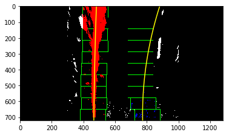


    histogram for image test1.jpg


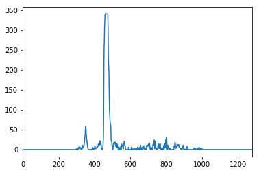


    ...


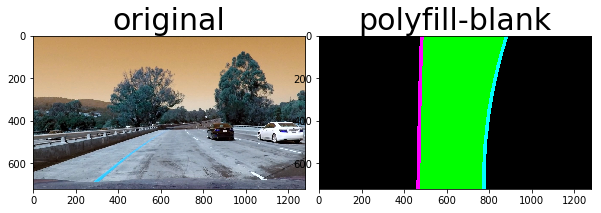


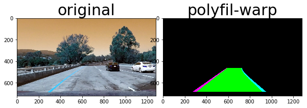


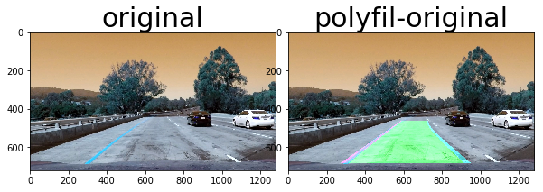


#### 5. Describe how (and identify where in your code) you calculated the radius of curvature of the lane and the position of the vehicle with respect to center.

Below is the code:

```python

# function to determine radius of curvature and distance from lane center based on binary image, polynomial fit
def calculate_rad(bin_img, l_fit, r_fit, l_lane_inds, r_lane_inds):
    
    # Define conversions from pixels space to meters
    ym_per_pix = 30/720 # meters per pixel in y dimension, lane line is 10 ft = 3.048 meters
    xm_per_pix = 3.7/700 # meters per pixel in x dimension, lane width is 12 ft = 3.7 meters
    
    left_curverad, right_curverad, center_dist = (0, 0, 0)
    
    # choose the maximum y-value (bottom of the image)
    h = bin_img.shape[0]
    ploty = np.linspace(0, h-1, h)
    y_eval = np.max(ploty)
  
    # Identify the x and y positions of all nonzero pixels in the image
    nonzero = bin_img.nonzero()
    nonzeroy = np.array(nonzero[0])
    nonzerox = np.array(nonzero[1])
    
    # Extract left and right line pixel positions
    leftx = nonzerox[l_lane_inds]
    lefty = nonzeroy[l_lane_inds] 
    rightx = nonzerox[r_lane_inds]
    righty = nonzeroy[r_lane_inds]
    
    if len(leftx) != 0 and len(rightx) != 0:
        
        # Fit new polynomials to x,y in world space
        left_fit_cr = np.polyfit(lefty*ym_per_pix, leftx*xm_per_pix, 2)
        right_fit_cr = np.polyfit(righty*ym_per_pix, rightx*xm_per_pix, 2)
        
        # Calculate the new radii of curvature
        left_curverad = ((1 + (2*left_fit_cr[0]*y_eval*ym_per_pix + left_fit_cr[1])**2)**1.5) / np.absolute(2*left_fit_cr[0])
        right_curverad = ((1 + (2*right_fit_cr[0]*y_eval*ym_per_pix + right_fit_cr[1])**2)**1.5) / np.absolute(2*right_fit_cr[0])
        
        # Now our radius of curvature is in meters
    
    # Distance from center is image x midpoint - mean of l_fit and r_fit intercepts 
    if r_fit is not None and l_fit is not None:
        car_position = bin_img.shape[1]/2
        l_fit_x_int = l_fit[0]*h**2 + l_fit[1]*h + l_fit[2]
        r_fit_x_int = r_fit[0]*h**2 + r_fit[1]*h + r_fit[2]
        lane_center_position = (r_fit_x_int + l_fit_x_int) /2
        center_dist = (car_position - lane_center_position) * xm_per_pix
    return left_curverad, right_curverad, center_dist
    
    
    def draw_curvature(original_img, curv_rad, center_dist):
    font = cv2.FONT_HERSHEY_SIMPLEX
    new_img = np.copy(original_img)
    h = new_img.shape[0]
    text = 'Curve radius: ' + '{:04.1f}'.format(curv_rad) + 'm'
    cv2.putText(new_img, text, (40,70), font, 1.5, (200,255,155), 2, cv2.LINE_AA)
    direction = ''
    if center_dist > 0:
        direction = 'right'
    elif center_dist < 0:
        direction = 'left'
    abs_center_dist = abs(center_dist)
    text = '{:04.1f}'.format(abs_center_dist) + 'm ' + direction + ' of center'
    cv2.putText(new_img, text, (40,120), font, 1.5, (200,255,155), 2, cv2.LINE_AA)
    return new_img

def write_Text(original_img, curv_rad, center_dist):
    new_img = np.copy(original_img)
    h = new_img.shape[0]
    text = 'Radius of curve is: ' + '{:04.2f}'.format(curv_rad) + 'm'
    cv2.putText(new_img, text, (40,70), font, 1.5, (200,255,155), 2, cv2.LINE_AA)
    direction = ''
    if center_dist > 0:
        direction = 'right'
    elif center_dist < 0:
        direction = 'left'
    abs_center_dist = abs(center_dist)
    text = '{:04.3f}'.format(abs_center_dist) + 'm ' + direction + ' of center'
    cv2.putText(new_img, text, (40,120), font, 1.5, (200,255,155), 2, cv2.LINE_AA)
    return new_img

```


#### 6. Provide an example image of your result plotted back down onto the road such that the lane area is identified clearly.

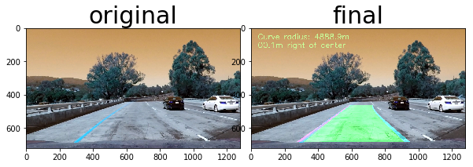


### Pipeline (video)

#### 1. Provide a link to your final video output.  Your pipeline should perform reasonably well on the entire project video (wobbly lines are ok but no catastrophic failures that would cause the car to drive off the road!).

Here's a [link to my video result](./project_video_output.mp4)

---

### Discussion

#### 1. Briefly discuss any problems / issues you faced in your implementation of this project.  Where will your pipeline likely fail?  What could you do to make it more robust?

My implementation fails partially for Challenge and fully for the other challenging video. I believe this is because, fitting needs to be improved in my code. Also i had set ROI to filter noises. Hence this is creating issues when the lane curvature is very high and implementation tries to map the lane within ROI and hence lanes are not correctly mapped. Also i need to look for other color thresholds and other pre processing technique to improve the binary image quality


## Here is the main code


```python
import numpy as np
import cv2
import matplotlib.pyplot as plt
import matplotlib.image as mpimg
%matplotlib inline
import os

debug_flag = False
output_flag = False
final_flag = False


# set debug flag to True if you want debug messages to be displayed
# set output flag to True if you want to see intermittant output images to ensure that individual 
# functions are working fine
# set final flag to true to see only the final output images
# set all flags to false when running video or multiple images
# all functions use del to delete intermediate objects to freeup memory

#---------------------------------------------------------------------------------------------------------------------------#

# this function calibrates the camera. Takes inputs as Path- Path where calibration images are present.
# Imgcornertype 69 or 68 depending upon no of corners
# function returns - ret,mtx,dist,rvecs,tvecs

def calibrate_camera(path,imgcornertype):
    
    if debug_flag == True:
        print("starting camera calibration")
        print("!!!!!!!!!!!!!!!!!!!!!!!!!!!!!!!!!!!!!!!!!!!!!!!!")
    
    #initialize arrays to store object and image points
    objpoints = [] #3d points in real world space
    imgpoints = [] #2d points in image space
    
    if output_flag == True:
        fig, axs = plt.subplots(5,4, figsize=(16, 11))
        fig.subplots_adjust(hspace = .2, wspace=.001)
        axs = axs.ravel()
    
    if imgcornertype == 69:
        objp = np.zeros((6*9,3), np.float32)
        objp[:,:2] = np.mgrid[0:9,0:6].T.reshape(-1,2)
    elif imgcornertype == 68:
        objp = np.zeros((6*8,3),np.float32)
        objp[:,:2] = np.mgrid[0:8,0:6].T.reshape(-1,2)
            
    if imgcornertype == 69:
        cory = 9
        corx = 6
    elif imgcornertype == 68:
        corx = 6
        cory = 8
    index = 0 
    
    for imagename in os.listdir(path):
        
        img = cv2.imread(path + imagename)
        if output_flag == True:
            print('calibrating camera for image', imagename)
            #plt.imshow(img)
            #plt.show()

        # Conver to grayscale
        gray = cv2.cvtColor(img,cv2.COLOR_BGR2GRAY)

        # find chessboard corners
        ret,corners = cv2.findChessboardCorners(gray,(cory,corx),None)
               

        #if corners are found, add object points, img points
        if ret == True:
            imgpoints.append(corners)
            objpoints.append(objp)
            img = cv2.drawChessboardCorners(img,(cory,corx),corners,ret)
            if output_flag == True:
                axs[index].axis('off')
                axs[index].imshow(img)
                index += 1
            if debug_flag == True:
                print("corner identified for image",imagename)
                print("corner shape is ", corners.shape)
                print("corner is ", corners)
                       
        else:
             if debug_flag == True:
                    print("corners not identified for image",imagename)


    #get calibration matrix
    ret,mtx,dist,rvecs,tvecs = cv2.calibrateCamera(objpoints,imgpoints,gray.shape[::-1],None,None)
    

    if debug_flag == True:
        print(gray.shape[::-1])
        print("ret is ",ret)
        print("mtx is", mtx)
        print("dist is", dist)
        print("rvecs is ", rvecs)
        print("tvecs is", tvecs)
        print("camera calibration done. ")
        print("!!!!!!!!!!!!!!!!!!!!!!!!!!!!!!!!!!!!!!!!!!!!!!!!")

    # delete unwanted objects        
    del objpoints
    del imgpoints
    
    return ret,mtx,dist,rvecs,tvecs

# function undistors the image
def undistort_img(img,mtx,dist):
    img = cv2.undistort(img,mtx,dist,None,mtx)
    return img

# function does a perspective transformation
def unwarp_image(img, src, dst):
    height,width = img.shape[:2]
    M = cv2.getPerspectiveTransform(src, dst)
    Minv = cv2.getPerspectiveTransform(dst, src)
    warped = cv2.warpPerspective(img, M, (width,height), flags=cv2.INTER_LINEAR)
    return warped, M, Minv

#function to calculate magnitude threshold
def mag_thresh(img, sobel_kernel=3, mag_thresh=(50, 255)):
    # Apply the following steps to img
    #print('image shape before graying',img.shape)
    img = cv2.cvtColor(img,cv2.COLOR_BGR2GRAY)
    #print('image shape after graying',img.shape)
    sobelx = cv2.Sobel(img,cv2.CV_64F,1,0,sobel_kernel)
    #print('sobelx',sobelx)
    abs_sobelx = np.absolute(sobelx)
    #print('absolute sobelx',abs_sobelx)
    sobely = cv2.Sobel(img,cv2.CV_64F,0,1,sobel_kernel)
    #print('sobely',sobely)
    #abs_sobely = np.absolute(sobely)
    #print('abs sobely',abs_sobely)
    abs_sobelxory = np.sqrt(sobelx**2 + sobely**2)
    #print('abs_sobelxory',abs_sobelxory)
    scaled_sobel = np.uint8(255*abs_sobelxory/np.max(abs_sobelxory))
    #print('scaled sobel',scaled_sobel)
    threshold_min = mag_thresh[0]
    threshold_max = mag_thresh[1]
    binary_output = np.zeros_like(scaled_sobel)
    binary_output[(scaled_sobel >= threshold_min) & (scaled_sobel <= threshold_max)]=1
    #print(binary_output)
    return binary_output


#function to calculate the direction threshold
def dir_threshold(img, sobel_kernel=2, thresh=(0.0001,.09)):
    # Apply the following steps to img
    # 1) Convert to grayscale
    img = cv2.cvtColor(img,cv2.COLOR_BGR2GRAY)
    # 2) Take the gradient in x and y separately
    sobelx = cv2.Sobel(img,cv2.CV_64F,1,0,sobel_kernel)
    sobely = cv2.Sobel(img,cv2.CV_64F,0,1,sobel_kernel)
    # 3) Take the absolute value of the x and y gradients
    abs_sobelx = np.absolute(sobelx)
    abs_sobely = np.absolute(sobely)
    # 4) Use np.arctan2(abs_sobely, abs_sobelx) to calculate the direction of the gradient 
    gradient_dir = np.arctan2(abs_sobely,abs_sobelx)
    # 5) Create a binary mask where direction thresholds are met
    binary_output = np.zeros_like(gradient_dir)
    binary_output[(gradient_dir >= thresh[0]) & (gradient_dir <= thresh[1])] = 1
    # 6) Return this mask as your binary_output image
    return binary_output
    
# function to calculate the h variant of image
def hls_h_select(img, thresh=(100, 255)):
    hls = cv2.cvtColor(img,cv2.COLOR_BGR2HLS)
    S = hls[:,:,0]
    binary_output = np.zeros_like(S)
    binary_output[(S >= thresh[0]) & (S <= thresh[1])]=1
    return binary_output
    
# function to calculate the l variant of image
def hls_l_select(img, thresh=(100, 255)):
    hls = cv2.cvtColor(img,cv2.COLOR_BGR2HLS)
    S = hls[:,:,1]
    binary_output = np.zeros_like(S)
    binary_output[(S >= thresh[0]) & (S <= thresh[1])]=1
    return binary_output
    
# function to calculate the s variant of image
def hls_s_select(img, thresh=(80, 255)):
    hls = cv2.cvtColor(img,cv2.COLOR_BGR2HLS)
    S = hls[:,:,2]
    binary_output = np.zeros_like(S)
    binary_output[(S >= thresh[0]) & (S <= thresh[1])]=1
    return binary_output

# function to calculate absolute sobel threshold
def abs_sobel_thresh(img, orient='x', sobel_kernel=3, thresh=(30, 255)):
    # Calculate directional gradient
    # Apply threshold
    img = cv2.cvtColor(img,cv2.COLOR_BGR2GRAY)
    if orient == 'x':
        sobelxory = cv2.Sobel(img,cv2.CV_64F,1,0)
        abs_sobelxory = np.absolute(sobelxory)
    else:
        sobelxory = cv2.Sobel(img,cv2.CV_64F,0,1)
        abs_sobelxory = np.absolute(sobelxory)
    scaled_sobel = np.uint8(255*abs_sobelxory/np.max(abs_sobelxory))
    threshold_min = thresh[0]
    threshold_max = thresh[1]
    binary_output = np.zeros_like(scaled_sobel)
    binary_output[(scaled_sobel >= threshold_min) & (scaled_sobel <= threshold_max)]=1
    return binary_output
          
# set ROI for an image img based on the input vertices
def set_ROI(img,vertices):
    mask = np.zeros_like(img)
    if len(img.shape) > 2:
        channel_count = img.shape[2]  
        ignore_mask_color = (255,) * channel_count
    else:
        ignore_mask_color = 255
    cv2.fillPoly(mask, np.int32([vertices]), ignore_mask_color)
    masked_image = cv2.bitwise_and(img, mask)
    return masked_image
```


```python
##############################Sliding window and polyfitting ###########################################

# this function takes image as input (warped binary image) and takes histogram to identify the lane. Once lanes 
# positions are identified, the polynomial function is used to retrieve the co-oeffiecients to fit the lane
# this function is used only for the first image

def sliding_window_polyfit(img):
    
    if debug_flag == True:
        print('starting sliding window polyfit')
       
    histogram = np.sum(img[img.shape[0]//2:,:], axis=0)
    
    # Create an output image to draw on and  visualize the result
    out_img = np.dstack((img, img, img))*255
    
    # Find the peak of the left and right halves of the histogram
    # These will be the starting point for the left and right lines
    midpoint = np.int(histogram.shape[0]//2)
    leftx_base = np.argmax(histogram[:midpoint])
    rightx_base = np.argmax(histogram[midpoint:]) + midpoint
    if debug_flag == True:
        print("midpoint of histogram is", midpoint)
        print("leftx_base of histogram is", leftx_base)
        print("rightx_base of histogram is", rightx_base)
        
    # Choose the number of sliding windows
    nwindows = 10
    
    # Set height of windows
    window_height = np.int(img.shape[0]/nwindows)
    
    # Identify the x and y positions of all nonzero pixels in the image
    nonzero = img.nonzero()
    nonzeroy = np.array(nonzero[0])
    nonzerox = np.array(nonzero[1])
    
      
    # Current positions to be updated for each window
    leftx_current = leftx_base
    rightx_current = rightx_base
    
    if debug_flag == True:
        print("nonzeroy is ", nonzeroy)
        print("nonzerox is ", nonzerox)
        print("current position lefx", leftx_current )
        print("current position rightx", rightx_current )
        
    # Set the width of the windows +/- margin
    margin = 80
    
    # Set minimum number of pixels found to recenter window
    minpix = 50
    
    # Create empty lists to receive left and right lane pixel indices
    left_lane_inds = []
    right_lane_inds = []

    # Step through the windows one by one
    for window in range(nwindows):
        # Identify window boundaries in x and y (and right and left)
        win_y_low = img.shape[0] - (window+1)*window_height
        win_y_high = img.shape[0] - window*window_height
        win_xleft_low = leftx_current - margin
        win_xleft_high = leftx_current + margin
        win_xright_low = rightx_current - margin
        win_xright_high = rightx_current + margin
        # Draw the windows on the visualization image
        cv2.rectangle(out_img,(win_xleft_low,win_y_low),(win_xleft_high,win_y_high),
        (0,255,0), 2) 
        cv2.rectangle(out_img,(win_xright_low,win_y_low),(win_xright_high,win_y_high),
        (0,255,0), 2) 
        # Identify the nonzero pixels in x and y within the window
        good_left_inds = ((nonzeroy >= win_y_low) & (nonzeroy < win_y_high) & 
        (nonzerox >= win_xleft_low) &  (nonzerox < win_xleft_high)).nonzero()[0]
        good_right_inds = ((nonzeroy >= win_y_low) & (nonzeroy < win_y_high) & 
        (nonzerox >= win_xright_low) &  (nonzerox < win_xright_high)).nonzero()[0]
        # Append these indices to the lists
        left_lane_inds.append(good_left_inds)
        right_lane_inds.append(good_right_inds)
        # If you found > minpix pixels, recenter next window on their mean position
        if len(good_left_inds) > minpix:
            leftx_current = np.int(np.mean(nonzerox[good_left_inds]))
        if len(good_right_inds) > minpix:        
            rightx_current = np.int(np.mean(nonzerox[good_right_inds]))
        if debug_flag == True:
            print("window is ", window)
            print("win_y_low", win_y_low)
            print("win_y_high", win_y_high)
            print("win_xleft_low",win_xleft_low)
            print("win_xleft_high",win_xleft_high)
            print("win_xright_low",win_xright_low)
            print("win_xright_high",win_xright_high)
            print("good_left_inds",good_left_inds)
            print("good_right_inds",good_right_inds)
            

    # Concatenate the arrays of indices
    left_lane_inds = np.concatenate(left_lane_inds)
    right_lane_inds = np.concatenate(right_lane_inds)

    # Extract left and right line pixel positions
    leftx = nonzerox[left_lane_inds]
    lefty = nonzeroy[left_lane_inds] 
    rightx = nonzerox[right_lane_inds]
    righty = nonzeroy[right_lane_inds] 
    left_fit,right_fit = (None,None
                         )
    # Fit a second order polynomial to each
    if debug_flag == True:
        print("leftx is ", leftx)
        print("lefty is ", lefty)
        print("rightx is ", rightx)
        print("righty is ", righty)
        
    if len(leftx) != 0:
        left_fit = np.polyfit(lefty, leftx, 2)
    if len(rightx) != 0:
        right_fit = np.polyfit(righty, rightx, 2)
    
    #########################start visualization #####################################
    if output_flag == True:
        ploty = np.linspace(0,img.shape[0]-1,img.shape[0])
    
        left_fitx = left_fit[0]*ploty**2 + left_fit[1]*ploty + left_fit[2]
        right_fitx = right_fit[0]*ploty**2 + right_fit[1]*ploty + right_fit[2]

        out_img[nonzeroy[left_lane_inds], nonzerox[left_lane_inds]] = [255, 0, 0]
        out_img[nonzeroy[right_lane_inds], nonzerox[right_lane_inds]] = [0, 0, 255]
        plt.imshow(out_img)
        plt.plot(left_fitx, ploty, color='yellow')
        plt.plot(right_fitx, ploty, color='yellow')
        plt.xlim(0, 1280)
        plt.ylim(720, 0)
        plt.show()
    del nonzero
    del nonzerox
    del nonzeroy
    return left_fit,right_fit, left_lane_inds,right_lane_inds,histogram

# this function is used for subsequent images to fit based on the previous fit

def  polyfit_next_fit(img, left_fit, right_fit):
    if debug_flag == True:
        print("left fit input to polyfit_next_fit is ", left_fit)
        print("right fit input to polyfit_next_fit is", right_fit)
        
    nonzero = img.nonzero()
    nonzeroy = np.array(nonzero[0])
    nonzerox = np.array(nonzero[1])
    margin = 80
    left_lane_inds = ((nonzerox > (left_fit[0]*(nonzeroy**2) + left_fit[1]*nonzeroy + 
    left_fit[2] - margin)) & (nonzerox < (left_fit[0]*(nonzeroy**2) + 
    left_fit[1]*nonzeroy + left_fit[2] + margin))) 

    right_lane_inds = ((nonzerox > (right_fit[0]*(nonzeroy**2) + right_fit[1]*nonzeroy + 
    right_fit[2] - margin)) & (nonzerox < (right_fit[0]*(nonzeroy**2) + 
    right_fit[1]*nonzeroy + right_fit[2] + margin)))  

    # Again, extract left and right line pixel positions
    leftx = nonzerox[left_lane_inds]
    lefty = nonzeroy[left_lane_inds] 
    rightx = nonzerox[right_lane_inds]
    righty = nonzeroy[right_lane_inds]
    
    if debug_flag == True:
        print("left fit input is ", left_fit)
        print("right fit input is ", right_fit)
        print("leftx is ", leftx)
        print("lefty is ", lefty)
        print("rightx is ", rightx)
        print("righty is ", righty)
        
    left_fit,right_fit = (None,None)
        
    # Fit a second order polynomial to each
    if len(leftx) != 0:
        left_fit = np.polyfit(lefty, leftx, 2)
    if len(rightx) != 0:
        right_fit = np.polyfit(righty, rightx, 2)
    # Generate x and y values for plotting
    ploty = np.linspace(0, img.shape[0]-1, img.shape[0] )
    left_fitx = left_fit[0]*ploty**2 + left_fit[1]*ploty + left_fit[2]
    right_fitx = right_fit[0]*ploty**2 + right_fit[1]*ploty + right_fit[2]
    
    # start visualization ################################################
    if output_flag == True:
        out_img = np.dstack((img, img, img))*255
        window_img = np.zeros_like(out_img)

        # Color in left and right line pixels
        out_img[nonzeroy[left_lane_inds], nonzerox[left_lane_inds]] = [255, 0, 0]
        out_img[nonzeroy[right_lane_inds], nonzerox[right_lane_inds]] = [0, 0, 255]

        # Generate a polygon to illustrate the search window area
        # And recast the x and y points into usable format for cv2.fillPoly()
        left_line_window1 = np.array([np.transpose(np.vstack([left_fitx-margin, ploty]))])
        left_line_window2 = np.array([np.flipud(np.transpose(np.vstack([left_fitx+margin, 
                                      ploty])))])
        left_line_pts = np.hstack((left_line_window1, left_line_window2))
        right_line_window1 = np.array([np.transpose(np.vstack([right_fitx-margin, ploty]))])
        right_line_window2 = np.array([np.flipud(np.transpose(np.vstack([right_fitx+margin, 
                                      ploty])))])
        right_line_pts = np.hstack((right_line_window1, right_line_window2))

        # Draw the lane onto the warped blank image
        cv2.fillPoly(window_img, np.int_([left_line_pts]), (0,255, 0))
        cv2.fillPoly(window_img, np.int_([right_line_pts]), (0,255, 0))
        result = cv2.addWeighted(out_img, 1, window_img, 0.3, 0)
        plt.imshow(result)
        plt.plot(left_fitx, ploty, color='yellow')
        plt.plot(right_fitx, ploty, color='yellow')
        plt.xlim(0, 1280)
        plt.ylim(720, 0)
        plt.show()
        
    del nonzero
    del nonzerox
    del nonzeroy
    return left_fit,right_fit, left_lane_inds,right_lane_inds


# function to determine radius of curvature and distance from lane center based on binary image, polynomial fit
def calculate_rad(bin_img, l_fit, r_fit, l_lane_inds, r_lane_inds):
    
    # Define conversions from pixels space to meters
    ym_per_pix = 30/720 # meters per pixel in y dimension, lane line is 10 ft = 3.048 meters
    xm_per_pix = 3.7/700 # meters per pixel in x dimension, lane width is 12 ft = 3.7 meters
    
    left_curverad, right_curverad, center_dist = (0, 0, 0)
    
    # choose the maximum y-value (bottom of the image)
    h = bin_img.shape[0]
    ploty = np.linspace(0, h-1, h)
    y_eval = np.max(ploty)
  
    # Identify the x and y positions of all nonzero pixels in the image
    nonzero = bin_img.nonzero()
    nonzeroy = np.array(nonzero[0])
    nonzerox = np.array(nonzero[1])
    
    # Extract left and right line pixel positions
    leftx = nonzerox[l_lane_inds]
    lefty = nonzeroy[l_lane_inds] 
    rightx = nonzerox[r_lane_inds]
    righty = nonzeroy[r_lane_inds]
    
    if len(leftx) != 0 and len(rightx) != 0:
        
        # Fit new polynomials to x,y in world space
        left_fit_cr = np.polyfit(lefty*ym_per_pix, leftx*xm_per_pix, 2)
        right_fit_cr = np.polyfit(righty*ym_per_pix, rightx*xm_per_pix, 2)
        
        # Calculate the new radii of curvature
        left_curverad = ((1 + (2*left_fit_cr[0]*y_eval*ym_per_pix + left_fit_cr[1])**2)**1.5) / np.absolute(2*left_fit_cr[0])
        right_curverad = ((1 + (2*right_fit_cr[0]*y_eval*ym_per_pix + right_fit_cr[1])**2)**1.5) / np.absolute(2*right_fit_cr[0])
        
        # Now our radius of curvature is in meters
    
    # Distance from center is image x midpoint - mean of l_fit and r_fit intercepts 
    if r_fit is not None and l_fit is not None:
        car_position = bin_img.shape[1]/2
        l_fit_x_int = l_fit[0]*h**2 + l_fit[1]*h + l_fit[2]
        r_fit_x_int = r_fit[0]*h**2 + r_fit[1]*h + r_fit[2]
        lane_center_position = (r_fit_x_int + l_fit_x_int) /2
        center_dist = (car_position - lane_center_position) * xm_per_pix
    return left_curverad, right_curverad, center_dist


def draw_lane(original_img, binary_img, l_fit, r_fit, Minv):
    
    new_img = np.copy(original_img)
   
    if l_fit is None or r_fit is None:
        print("no fit found. returning original image")
        return original_img
    # Create an image to draw the lines on
    warp_zero = np.zeros_like(binary_img).astype(np.uint8)
    color_warp = np.dstack((warp_zero, warp_zero, warp_zero))
    
    h,w = binary_img.shape
    ploty = np.linspace(0, h-1, num=h)# to cover same y-range as image
    
    if debug_flag == True:
        print("shape of ploty", ploty)
    left_fitx = l_fit[0]*ploty**2 + l_fit[1]*ploty + l_fit[2]
    right_fitx = r_fit[0]*ploty**2 + r_fit[1]*ploty + r_fit[2]
    
    if debug_flag == True:
        print("starting drawing lane")
        print("left fit is ", l_fit)
        print("right fit is ", r_fit)
        print('left fitx is', left_fitx)
        print('right fitx is ', right_fitx)
        print("ploty is ",ploty)

    pts_left = np.array([np.transpose(np.vstack([left_fitx, ploty]))])
    pts_right = np.array([np.flipud(np.transpose(np.vstack([right_fitx, ploty])))])
    pts = np.hstack((pts_left, pts_right))

    # Draw the lane onto the warped blank image
    cv2.fillPoly(color_warp, np.int_([pts]), (0,255, 0))
    cv2.polylines(color_warp, np.int32([pts_left]), isClosed=False, color=(255,0,255), thickness=15)
    cv2.polylines(color_warp, np.int32([pts_right]), isClosed=False, color=(0,255,255), thickness=15)
    
    if output_flag == True:
        draw_simple_chart(original_img,color_warp,"original","polyfill-blank")
    
    # Warp the blank back to original image space using inverse perspective matrix (Minv)
    newwarp = cv2.warpPerspective(color_warp, Minv, (w, h)) 
    
    if output_flag == True:
        draw_simple_chart(original_img,newwarp,"original","polyfil-warp")
    
    # Combine the result with the original image
    result = cv2.addWeighted(new_img, 1, newwarp, 0.5, 0)
    
    if output_flag == True:
        draw_simple_chart(original_img,result,"original","polyfil-original")
    
    return result

def draw_curvature(original_img, curv_rad, center_dist):
    font = cv2.FONT_HERSHEY_SIMPLEX
    new_img = np.copy(original_img)
    h = new_img.shape[0]
    text = 'Curve radius: ' + '{:04.1f}'.format(curv_rad) + 'm'
    cv2.putText(new_img, text, (40,70), font, 1.5, (200,255,155), 2, cv2.LINE_AA)
    direction = ''
    if center_dist > 0:
        direction = 'right'
    elif center_dist < 0:
        direction = 'left'
    abs_center_dist = abs(center_dist)
    text = '{:04.1f}'.format(abs_center_dist) + 'm ' + direction + ' of center'
    cv2.putText(new_img, text, (40,120), font, 1.5, (200,255,155), 2, cv2.LINE_AA)
    return new_img

def write_Text(original_img, curv_rad, center_dist):
    new_img = np.copy(original_img)
    h = new_img.shape[0]
    text = 'Radius of curve is: ' + '{:04.2f}'.format(curv_rad) + 'm'
    cv2.putText(new_img, text, (40,70), font, 1.5, (200,255,155), 2, cv2.LINE_AA)
    direction = ''
    if center_dist > 0:
        direction = 'right'
    elif center_dist < 0:
        direction = 'left'
    abs_center_dist = abs(center_dist)
    text = '{:04.3f}'.format(abs_center_dist) + 'm ' + direction + ' of center'
    cv2.putText(new_img, text, (40,120), font, 1.5, (200,255,155), 2, cv2.LINE_AA)
    return new_img


def overlay_fit_onto_images(img, fit, plot_color):
    if fit is None:
        return img
    new_img = np.copy(img)
    h = new_img.shape[0]
    ploty = np.linspace(0, h-1, h)
    plotx = fit[0]*ploty**2 + fit[1]*ploty + fit[2]
    pts = np.array([np.transpose(np.vstack([plotx, ploty]))])
    cv2.polylines(new_img, np.int32([pts]), isClosed=False, color=plot_color, thickness=8)
    return new_img
    
```


```python
# create a pipeline to process the image and output a binary image. Pipeline processing includes teh following
#   1. Undistortion of image
#   2. Perpsective transformation of iamge. src and dst are selected based on the lane dimensions
#   3. calculate all thresholds like Sobel Magnitude, Direction, HLS and Sobel X,Y
# create intermediate images to check whether lanes are corrected identified by each of these cases
# based on the results obtained from multiple images, i went with the following combining of threshold to 
# create the final binary image
# combined[ ((img_gradx == 1) | (img_sobel_dir ==1) | ((img_hls_s ==1) & (img_hls_l ==1)))] =1
# other transformations are not used through they are present here for visual display purpose

def pipeline_image_processing(test_img,imagename):
    
    # undistor image
  
    test_img_undistort = undistort_img(test_img,mtx,dist)
    height,width = test_img_undistort.shape[:2]
    
    # define source and destination points for transform
    src = np.float32([(575,464),
                  (707,464), 
                  (258,682), 
                  (1049,682)])
    dst = np.float32([(450,0),
                  (width-450,0),
                  (450,height),
                  (width-450,height)])
     
    # map the src and dst points
    if debug_flag == True:
        print('undistored image')
        print("height is", height)
        print("width is", width)
        print("src is ", src)
        print("dest is ", dst)
    # perspective transformation
    
    = np.array([[300, 0], [300,700], [1000,700], [1000,0]])
   
    test_img_unwarp, M, Minv = unwarp_image(test_img_undistort,src,dst)

    if output_flag == True:
        fig,(axs1,axs2) = plt.subplots(1,2, figsize=(20, 10))
        fig.subplots_adjust(hspace = .2, wspace=.001)
        
        axs1.imshow(test_img)
        axs1.annotate('A',xy=(575,464),fontsize=20)
        axs1.annotate('B',xy=(707,464),fontsize=20)
        axs1.annotate('C',xy=(258,682),fontsize=20)
        axs1.annotate('D',xy=(1049,682),fontsize=20)
           
        axs2.imshow(test_img_unwarp)
        axs2.annotate('A',xy=(450,0),fontsize=20)
        axs2.annotate('B',xy=(width-450,0),fontsize=20)
        axs2.annotate('C',xy=(450,height),fontsize=20)
        axs2.annotate('D',xy=(width-450,height),fontsize=20)
        
    # Sobel Magnitude (using default parameters)
    img_sobel_Mag = set_ROI(mag_thresh(test_img_unwarp),vertices)
    
    # Sobel Direction (using default parameters)
    img_sobel_dir = set_ROI(dir_threshold(test_img_unwarp),vertices)
    
    if debug_flag == True:
        print('shape of img_sobel_Mg', img_sobel_Mag.shape)
        print('shape of img_sobel_dir', img_sobel_dir.shape)
        
    # HLS H-channel Threshold
    img_hls_h = set_ROI(hls_h_select(test_img_unwarp),vertices)
    
    # HLS S-channel Threshold
    img_hls_s = set_ROI(hls_s_select(test_img_unwarp),vertices)
    
    # HLS L-channel Threshold
    img_hls_l = set_ROI(hls_l_select(test_img_unwarp),vertices)
    
    #Sobel X and Y
    img_gradx = set_ROI(abs_sobel_thresh(test_img_unwarp, orient ='x', sobel_kernel = 3, thresh=(30,255)),vertices)
    
    img_grady = set_ROI(abs_sobel_thresh(test_img_unwarp, orient ='y', sobel_kernel = 3, thresh=(30,255)),vertices)
    
    combined = np.zeros_like(img_sobel_Mag)
    
    if output_flag == True:
    
        draw_simple_chart(test_img,test_img_undistort,'Original image','undistored image')
        draw_simple_chart(test_img,test_img_unwarp,'Original image','Perspective Transformed image')
        draw_simple_chart(test_img,img_sobel_dir,'Original image','Sobel Direction')
        draw_simple_chart(test_img,img_sobel_Mag,'Original image','Sobel Magnitude')
        draw_simple_chart(test_img,img_gradx,'Original image','Gradx')
        draw_simple_chart(test_img,img_grady,'Original image','Grady')
        draw_chart_channels(img_hls_h,img_hls_l,img_hls_s,"h channel","l channel","s channel")

    combined[ ((img_gradx == 1) | (img_sobel_dir ==1) | ((img_hls_s ==1) & (img_hls_l ==1)))] =1
    
    if debug_flag == True:
        print('combined initial shape', combined.shape)
        print('shape of img_gradx', img_gradx.shape)
        print('shape of img_grady', img_grady.shape)
        print('combined final shape', combined.shape)
        print('exiting pipeline processing')

    if final_flag == True:
        draw_simple_chart(test_img,combined,"original","binary")
    return combined, Minv     


#function to process multiple images using the Pipeline and does the below functions in addition to the pipeline:
#   1. Lane fitting
#   2. creating an image with polyfill to cast the lanes
#   3. recasting the polyfill image on the original image
#   4. Draw teh lane based on the above
#   5. caculate the radius and curature


def Fully_process_images(img,imagename):
   
    if debug_flag == True:
        print('starting process multiple iamges')
        print('starting pipeline process for ', imagename)
        print("l-allx",l_line.allx)
        print("r-allx", r_line.allx)
        print("l_line.ally",l_line.ally)
        print("r_line.ally", r_line.ally)
        print("r_line.bestx", r_line.bestx)
        print("l_line.bestx",l_line.bestx)
        print("r_line.best_fit",r_line.best_fit)
        print("l_line.best_fit",l_line.best_fit)
        print("r_line.current_fit",r_line.current_fit)
        print("l_line.current_fit",l_line.current_fit)
        
    new_img = np.copy(img)
    img_bin, Minv = pipeline_image_processing(new_img,imagename)
    if debug_flag == True:
        print('completed pipeline process for ',imagename)
    
    # if both left and right lines were detected last frame, use polyfit_using_prev_fit, otherwise use sliding window
    if not l_line.detected or not r_line.detected:
        if debug_flag == True:
            print('starting sliding window polyfit for first iamge')
        l_fit, r_fit, l_lane_inds, r_lane_inds, histogram = sliding_window_polyfit(img_bin)
        if debug_flag == True:
            print("left fit from sliding window output is ", l_fit)
            print("right fit from sliding window output is ", r_fit)
            print("left lane indic from sliding window output is ", l_lane_inds)
            print("right lane indic from sliding window output is ", r_lane_inds)
            
        if output_flag == True:
            print('histogram for image',imagename)
            plt.plot(histogram)
            plt.xlim(0, 1280)
            plt.show()
            print('...')
    else:
        l_fit, r_fit, l_lane_inds, r_lane_inds =  polyfit_next_fit(img_bin, l_line.best_fit, r_line.best_fit)
        if debug_flag == True:
            print('starting sliding window polyfit for subsequent images')
            print(l_line.best_fit)
            print("left fit is ", l_fit)
            print("right fit is ", r_fit)
        
    # invalidate both fits if the difference in their x-intercepts isn't around 350 px (+/- 100 px)
    if l_fit is not None and r_fit is not None:
        if debug_flag == True:
            print('Fit not found for ',imagename)
        # calculate x-intercept (bottom of image, x=image_height) for fits
        h = img.shape[0]
        l_fit_x_int = l_fit[0]*h**2 + l_fit[1]*h + l_fit[2]
        r_fit_x_int = r_fit[0]*h**2 + r_fit[1]*h + r_fit[2]
        x_int_diff = abs(r_fit_x_int-l_fit_x_int)
        if abs(350 - x_int_diff) > 100:
            l_fit = None
            r_fit = None
    else:
        if debug_flag == True:
            print('image invalidated failed',img)
    
    if debug_flag == True:
            print('adding right and left fit to class',imagename) 
            print('fit class values before adding')
            print("l-allx",l_line.allx)
            print("r-allx", r_line.allx)
            print("l_line.ally",l_line.ally)
            print("r_line.ally", r_line.ally)
            print("r_line.bestx", r_line.bestx)
            print("l_line.bestx",l_line.bestx)
            print("r_line.best_fit",r_line.best_fit)
            print("l_line.best_fit",l_line.best_fit)
            print("r_line.current_fit",r_line.current_fit)
            print("l_line.current_fit",l_line.current_fit)
            print("adding l_fit",l_fit)
            print("adding r_fit",r_fit)
            
            
    l_line.add_fit(l_fit, l_lane_inds)
    r_line.add_fit(r_fit, r_lane_inds)
    if debug_flag == True:
            print('added right and left fit to class',imagename) 
            print('fit class values after adding')
            print("r-allx", r_line.allx)
            print("l_line.ally",l_line.ally)
            print("r_line.ally", r_line.ally)
            print("r_line.bestx", r_line.bestx)
            print("l_line.bestx",l_line.bestx)
            print("r_line.best_fit",r_line.best_fit)
            print("l_line.best_fit",l_line.best_fit)
            print("r_line.current_fit",r_line.current_fit)
            print("l_line.current_fit",l_line.current_fit)
            
    # draw the current best fit if it exists
    if l_line.current_fit is not None and r_line.current_fit is not None:
        if debug_flag == True:
            print('best fit found',img)
        img_out1 = draw_lane(new_img, img_bin, l_line.best_fit, r_line.best_fit, Minv)
        rad_l, rad_r, d_center = calculate_rad(img_bin, l_line.best_fit, r_line.best_fit, 
                                                               l_lane_inds, r_lane_inds)
        img_out = draw_curvature(img_out1, (rad_l+rad_r)/2, d_center)
        
    else:
        print('best fit not found',imagename)
        img_out = new_img
        
    if final_flag == True:
        draw_simple_chart(img,img_out,"original","final")
    return img_out
```


```python
# Define a class to receive the characteristics of each line detection
class Line():
    def __init__(self):
        # was the line detected in the last iteration?
        self.detected = False  
        # x values of the last n fits of the line
        self.recent_xfitted = [] 
        #average x values of the fitted line over the last n iterations
        self.bestx = None     
        #polynomial coefficients averaged over the last n iterations
        self.best_fit = None  
        #polynomial coefficients for the most recent fit
        self.current_fit = [np.array([False])]  
        #radius of curvature of the line in some units
        self.radius_of_curvature = None 
        #distance in meters of vehicle center from the line
        self.line_base_pos = None 
        #difference in fit coefficients between last and new fits
        self.diffs = np.array([0,0,0], dtype='float') 
        #x values for detected line pixels
        self.allx = None  
        #y values for detected line pixels
        self.ally = None
        
    def add_fit(self, fit, inds):
        # add a found fit to the line, up to n
        if debug_flag == True:
            print("add_fit received fit", fit)
                 
            
        if fit is not None:
            if debug_flag == True:
                print("fit is not none")
            
            if self.best_fit is not None:
             
                self.diffs = abs(fit-self.best_fit)
            if (self.diffs[0] > 0.001 or \
               self.diffs[1] > 1.0 or \
               self.diffs[2] > 100.) and \
               len(self.current_fit) > 0:
               
                self.detected = False
                if debug_flag == True:
                    print('aborting fit')
            else:
                if debug_flag == True:
                    print("fit is none")
                self.detected = True
                self.px_count = np.count_nonzero(inds)
                self.current_fit.append(fit)
                # keep only one fit. discard other
                if len(self.current_fit) > 1:
                    if debug_flag == True:
                        print('replacing old fits with new')
                    # throw out old fits, keep newest n
                    self.current_fit = self.current_fit[len(self.current_fit)-1:]
                self.best_fit = np.average(self.current_fit, axis=0)
        # or remove one from the history, if not found
        else:
            if debug_flag == True:
                print('fit is empty or not there')
            self.detected = False
            if len(self.current_fit) > 0:
                # throw out oldest fit
                self.current_fit = self.current_fit[:len(self.current_fit)-1]
            if len(self.current_fit) > 0:
                # if there are still any fits in the queue, best_fit is their average
                self.best_fit = np.average(self.current_fit, axis=0)


# function to draw a chart with two images
def draw_simple_chart(image1,image2,title1,title2):
    if output_flag == True:
        
        f,(ax1,ax2) = plt.subplots(1,2,figsize =(10,5))
        f.subplots_adjust(hspace=.2,wspace=.05)
        if (len(image1.shape) < 3):
            ax1.imshow(image1,cmap ='gray')
        else:
            ax1.imshow(image1)
        ax1.set_title(title1,fontsize=30)
        
        if (len(image2.shape) < 3):
            ax2.imshow(image2,cmap ='gray')
        else:
            ax2.imshow(image2)
        ax2.set_title(title2,fontsize=30)
        plt.show()
        
# function to draw images containing three channels like RGB, HLS
def draw_chart_channels(image1,image2,image3,title1,title2,title3):
    
    if output_flag == True:
        f,(ax1,ax2, ax3) = plt.subplots(1,3,figsize =(20,10))
        f.subplots_adjust(hspace=.2,wspace=.05)
        if (len(image1.shape) < 3):
            ax1.imshow(image1,cmap ='gray')
        else:
            ax1.imshow(image1)
        ax1.set_title(title1,fontsize=30)
        
        if (len(image2.shape) < 3):
            ax2.imshow(image2,cmap ='gray')
        else:
            ax2.imshow(image2)
        ax2.set_title(title2,fontsize=30)  
        
        if (len(image3.shape) < 3):
            ax3.imshow(image3,cmap ='gray')
        else:
            ax3.imshow(image3)
        ax3.set_title(title3,fontsize=30)  
        plt.show()
        
```


```python
# Callibrate  Camera
output_flag = True
path1 = "./camera_cal/"
ret,mtx,dist,rvecs,tvecs = calibrate_camera(path1,69)#################    test images with pipeline to identify lane  #########################

```

    calibrating camera for image calibration10.jpg
    calibrating camera for image calibration6.jpg
    calibrating camera for image calibration9.jpg
    calibrating camera for image calibration7.jpg
    calibrating camera for image calibration19.jpg
    calibrating camera for image calibration20.jpg
    calibrating camera for image calibration16.jpg
    calibrating camera for image calibration1.jpg
    calibrating camera for image calibration17.jpg
    calibrating camera for image calibration2.jpg
    calibrating camera for image calibration8.jpg
    calibrating camera for image calibration4.jpg
    calibrating camera for image calibration15.jpg
    calibrating camera for image calibration3.jpg
    calibrating camera for image calibration14.jpg
    calibrating camera for image calibration11.jpg
    calibrating camera for image calibration13.jpg
    calibrating camera for image calibration12.jpg
    calibrating camera for image calibration5.jpg
    calibrating camera for image calibration18.jpg


```python
#################    test multiple images with pipeline  #########################
path2 = "./test_images/"
debug_flag = False
output_flag = True


l_line = Line()
r_line = Line()
    
for imagename in os.listdir(path2):
    if debug_flag == True:
        print("processing image", imagename)
    test_img = cv2.imread(path2 + imagename)
    
    img_bin, Minv = pipeline_image_processing(test_img,imagename)  
    
```


```python
#################    test Single image with pipeline to identify lane and polyfit #########################
path2 = "./test_images/"
imagename = "test1.jpg"
debug_flag = False
output_flag = True
final_flag = True

l_line = Line()
r_line = Line()
    

test_img = cv2.imread(path2 + imagename)
img_bin = Fully_process_images(test_img, imagename)

if debug_flag == True:
    print('processing image',path2 + imagename)
    print("test image shape is", test_img.shape)
    print("test image processed shape is", img_bin.shape)
```


    histogram for image test1.jpg


    ...


```python
 #################    test multiple images with pipeline to identify lane and polyfit #########################
path2 = "./test_images/"
debug_flag = False
output_flag = True
final_flag = True

l_line = Line()
r_line = Line()
    
for imagename in os.listdir(path2):
    test_img = cv2.imread(path2 + imagename)
    img_bin = Fully_process_images(test_img, imagename)
           
    if debug_flag == True:
        print('processing image',path2 + imagename)
        print("test image shape is", test_img.shape)
        print("test image processed shape is", img_bin.shape)
```


```python
#function to process images from the video and return the final processed image to recreate teh video output
import datetime
import time
def video_processing(img):
    ts = time.time()
    st = datetime.datetime.fromtimestamp(ts).strftime('%Y-%m-%d %H:%M:%S')
    if output_flag == True:
        plt.imshow(img)
        plt.show()
    img = Fully_process_images(img,"na")
    cv2.imwrite("./output_images/frame"+ st+ ".jpg" , img) 
    return img
```


```python
# process Project video
from moviepy.editor import VideoFileClip

debug_flag = False
output_flag = False
final_flag = False


l_line = Line()
r_line = Line()
video_output = 'project_video_output.mp4'
video_input = VideoFileClip('project_video.mp4')
processed_video = video_input.fl_image(video_processing)
%time processed_video.write_videofile(video_output, audio=False)
```

    [MoviePy] >>>> Building video project_video_output.mp4
    [MoviePy] Writing video project_video_output.mp4


    100%|█████████▉| 1260/1261 [05:50<00:00,  3.65it/s]


    [MoviePy] Done.
    [MoviePy] >>>> Video ready: project_video_output.mp4 
    
    CPU times: user 11min 3s, sys: 10.4 s, total: 11min 13s
    Wall time: 5min 51s

